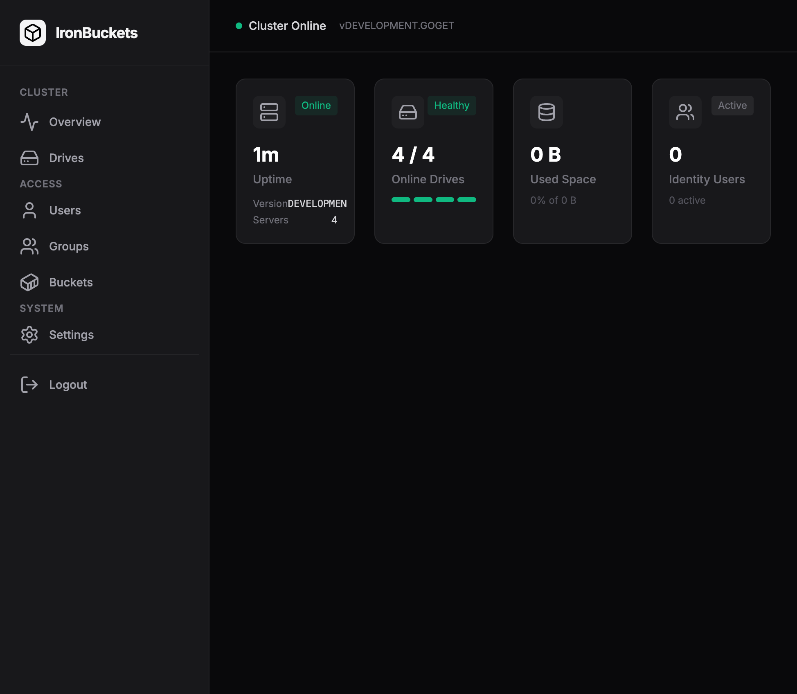

# IronBuckets

A modern web UI for managing MinIO clusters.



## Quick Start

```bash
# 1. Clone and configure
cp .env.example .env

# 2. Set your MinIO endpoint
echo "MINIO_ENDPOINT=localhost:9000" >> .env

# 3. Run
go run cmd/server/main.go
```

Open [http://localhost:8080](http://localhost:8080) and log in with your MinIO credentials.

## Features

- **Dashboard** — Server health, storage, and user stats at a glance
- **Bucket Management** — Create, configure, and delete buckets
- **Object Browser** — Upload, download, and manage files
- **User Management** — Create users and assign policies

## Documentation

- [Testing Guide](TESTING.md)
- [Security](SECURITY.md)
